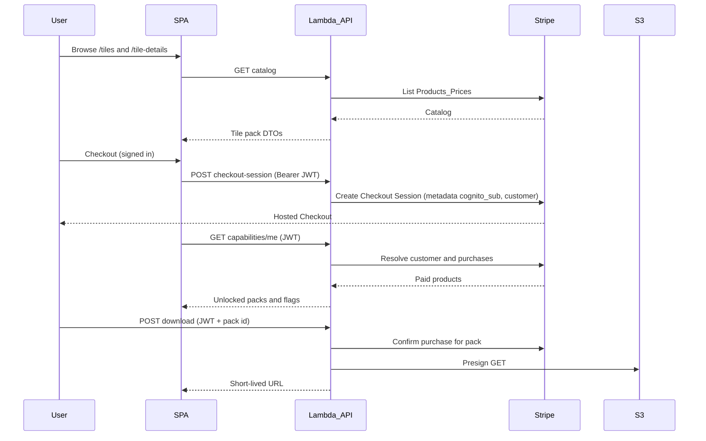

Repo copy of the GridSmith **Tile pack commerce v1** plan (version-controlled). A Cursor-managed copy may also exist at `~/.cursor/plans/tile_pack_commerce_v1_266f98a3.plan.md`—treat **this file as source of truth in git** when they differ.

# Tile pack commerce and data layer (v1)

## Decisions locked in

- **Admin**: same app, `/admin/*` routes gated by a **Cognito group** (e.g. `admins`), with the same enforcement in Lambda.
- **Checkout**: **signed-in only**; link purchases to users via **Cognito `sub`** and **Stripe Customer** (see below).
- **Products and orders**: **Stripe is the system of record**—no local mirror tables for catalog, orders, line items, or entitlements. **Capabilities and admin views** resolve ownership by calling the **Stripe API** at request time (with sensible caching later if needed).
- **Persistence**: **Do not create database tables until a feature actually needs them** (e.g. telemetry ingestion). No stub schemas for future saves/Room Builder until those features are implemented.

## Relationship to the old “Stripe subscriptions” plan

Keep: **API Gateway + Lambda**, **`GET /api/capabilities/me`**, **non-PII `analytics_subject_id`** for telemetry when that ships ([`src/analytics.ts`](../../src/analytics.ts) or sibling). **Drop**: subscription portal, local `purchases` / `entitlements` tables, and webhook-driven mirroring of Stripe objects—unless a future feature requires a webhook **and** durable idempotency (then add the smallest store only for that).

## Product catalog and orders (Stripe only)

- **Catalog**: Stripe **Products + Prices** (one-time `price`); merchandising in **Product `metadata`** (slug, image URL, description excerpt, sort hint, mapping to builder unlock flags / S3 prefix key).
- **Storefront**: `GET /api/catalog/tile-packs` — Lambda lists active products/prices via Stripe; secret key stays server-side.
- **“Does this user own pack X?”**: Lambda uses **Stripe Customer** linked to the user (see next section), then **Stripe APIs** to inspect paid Checkout Sessions / PaymentIntents / Charges as appropriate for your integration shape—**no app DB for order rows**.

### Linking Cognito `sub` to Stripe Customer (no “secrets” DB)

You typically need **one stable association**, not a full order database:

- **Recommended**: store **`stripe_customer_id`** in a **Cognito custom attribute** (e.g. `custom:stripe_customer_id`), set on first checkout/session creation. This is an **opaque identifier**, not a user-held secret and not a password.
- **Alternative**: put `cognito_sub` on **Stripe Customer `metadata`** and use **Stripe Customer Search** to resolve `sub` → customer when the custom attribute is empty (slightly more API work on cold start).

**What you do *not* need to store per user for v1:**

- No per-user API keys or download passwords in your database.
- No long-lived “download keys” in Dynamo/RDS if you use **short-lived presigned S3 URLs** issued after each authorized request.

Stripe **secret key**, **webhook signing secret**, and **S3 credentials** live in **Lambda/env/secrets manager**—they are **server** secrets, not end-user data.

## Commerce flow (Stripe-centric, no entitlement DB)

**Webhooks:** Optional for v1 if everything is read from Stripe on demand. Add a webhook later if you need async side effects (e.g. email, cache warm); if the handler must not run twice, introduce **minimal** idempotent storage **at that time**—not ahead of need.

## Download security (aligned with your note)

- **Requirement**: user **must be logged in** (valid **Cognito JWT** on the download request).
- **Pattern**: `POST /api/downloads/tile-pack` (or equivalent) with **Authorization: Bearer**; Lambda:
  1. Validates JWT and reads `sub`.
  2. Resolves Stripe Customer and **confirms** the user has paid for the **Stripe Product / Price** that maps to that STL bundle (via Stripe API).
  3. Returns a **short-lived S3 presigned URL** (e.g. 5–15 minutes).

The “secure key” is effectively the **HMAC-signed presigned URL** (capability URL), not a separate secret you store per user. Avoid putting long-lived download tokens in the database unless a product requirement explicitly needs them.

**S3**: Private bucket; object keys per pack/version; mapping from Stripe `product_id` (or metadata) → S3 prefix can live in **Stripe Product metadata** so it stays single-source.

## Where would a database live, and Dynamo vs RDS?

- **Hosting**: With Lambda in **AWS**, the natural default is **DynamoDB in the same region**—no servers, IAM integration, pay-per-use, fits append-only **telemetry** and later **saved design blobs** (metadata + S3 pointer or compressed attributes if small).
- **RDS / MariaDB**: Better if you want **SQL**, ad-hoc joins, or a team workflow centered on relational reporting. Less aligned with “Stripe owns commercial truth” unless you later mirror analytics or run complex ops dashboards off your own warehouse.

**Recommendation for this plan:** stay **tabless until telemetry**; when telemetry lands, add **DynamoDB** first. Revisit **RDS** only if you outgrow Dynamo for saved layouts, migrations, or reporting—or if the team standardizes on SQL.

## Local development vs production (avoid hitting prod)

Goal: **local webpack / Vite never “accidentally” calls prod API Gateway or prod Lambdas**, and **dev Lambdas never use live Stripe or prod S3.**

- **Separate API base URL per environment**
  - Frontend reads something like `API_BASE_URL` from env at build time (already the pattern for Cognito in webpack). **Local `.env`** should point at a **dev** API Gateway URL (or `http://localhost:3001` if you run APIs locally). **Production builds** (CI / Vercel) inject the **prod** URL only in the prod pipeline. Never use the prod URL as the default in committed example env files.
- **Separate AWS deployments (stages or stacks)**
  - One CDK/SAM/Terraform **stack** or **stage** per environment (`dev`, `staging`, `prod`) so dev has its **own** API Gateway ID, Lambda ARNs, and (when added) Dynamo tables and S3 buckets. Local dev targets **dev** only.
- **Stripe: test mode in non-prod**
  - Dev Lambdas and local tools use **`sk_test_` / restricted test keys**. Prod Lambdas use **`sk_live_`** only via prod secrets. Optional safety: Lambda asserts `STRIPE_KEY` prefix matches expected mode for `STAGE` (fail fast if `sk_live_` on `dev`).
- **Cognito**
  - Prefer a **dev User Pool** (or dev app client) for local and dev APIs so tokens and `custom:stripe_customer_id` never mix with real users. If you must share a pool, treat it as higher risk and rely even more on Stripe test mode.
- **S3**
  - **Dev bucket** for dev/staging presigns; **prod bucket** only in prod Lambda env.
- **Running Lambdas locally**
  - **SAM local / `serverless offline` / similar** still use **dev** credentials and **test** Stripe keys from a local profile or `.env`, not production secrets.
- **Operational guardrails**
  - Restrict who can deploy to prod; use **IAM** so dev laptops cannot invoke **prod** Lambdas by default. API keys in docs are **dev** only.

## Routes and UI (frontend)

- **Phase 1 (UI — done in repo):**
  - **`/tiles`:** PrimeReact grid (`Card`, `Tag`, etc.) backed by [`src/data/placeholderTileSets.ts`](../../src/data/placeholderTileSets.ts): sort `order`, optional `disabled` (dimmed card, coming-soon overlay, no link to detail), optional `priceLabel`, shared placeholder copy/images as needed.
  - **`/tile-details/:slug`:** Product layout (breadcrumb, gallery + thumbs, description beside/below hero, PrimeReact `Dialog` / `Button` / `Divider`). Listing `disabled` drives merchandising copy (e.g. price fallback); **`addToCartDisabled`** is separate—button stays enabled; when true, **Add to cart** opens a **coming soon** modal (finishing touches + check back / create account copy, **Ok** dismisses). When false, checkout is still **not** wired (Stripe in later phases).
  - **Nested routes:** Webpack `publicPath: '/'`, root-absolute `public/index.html` asset tags, and resolved `url()` for PrimeIcons so WASM/fonts/scripts do not 404 under `/tile-details/...`.
  - **Prod:** Storefront shell deployed (or deploying) so visitors see `/tiles` and `/tile-details`; commerce APIs remain future work.
- **Phase 2:** Swap the data source to `GET /api/catalog/tile-packs` without redesigning the layout.
- [`App.tsx`](../../src/components/App.tsx): routing for both phases; stable id in the detail URL (slug or future `product_id`).
- **Cart**: client-only line items → one Checkout Session (after backend exists).
- [`AuthContext.tsx`](../../src/components/AuthContext.tsx): require sign-in for checkout and download.
- [`TileBuilderPanel.tsx`](../../src/components/TileBuilderPanel.tsx) / [`App.tsx`](../../src/components/App.tsx): gates driven by **`/api/capabilities/me`** (backed by Stripe, not a local entitlements table).

## Admin (in-app)

- `/admin/users` (or similar): **Cognito group** on JWT; Lambda calls **Stripe** (and Cognito Admin API if needed) to show customer + payment history—still **no local order mirror** unless you add it later for a concrete reason.

## Marketing newsletter opt-in (store in Cognito)

**Yes.** With your current **User Pool + Hosted UI + Google** setup, you can keep a marketing flag on the **Cognito user record**—no separate “emails DB” required for the boolean.

- **How:** Add **custom attributes** on the user pool, e.g. `custom:marketing_opt_in` (`"true"` / `"false"`) and optionally `custom:marketing_opt_in_at` (ISO timestamp) and/or a **policy version** string for consent auditing.
- **Pool schema:** Define these in the Cognito user pool (Console or IaC). Optional attributes can often be added to an existing pool; confirm in your account’s Cognito console.
- **Where users opt in:** Google’s account chooser **does not** include your checkbox. Collect consent **inside GridSmith** after sign-in (e.g. banner/modal on first visit, or **Profile / Settings**), with required legal copy and link to privacy policy.
- **Writing the value:** The browser **cannot** safely call Cognito admin APIs. Use a **small authenticated API** (future Lambda): verify the user’s JWT, then call **`AdminUpdateUserAttributes`** for **that** `sub` only (map `email` → username if you use federated identities, or use the **sub** as needed per your pool’s username scheme).
- **Reading in the app:** If the SPA should read the flag without an extra API call, add the custom attribute(s) to the **app client’s “read attributes”** so they appear in the **ID token**; extend [`AuthContext.tsx`](../../src/components/AuthContext.tsx) to parse them. Alternatively, expose `GET /api/me/marketing` that reads Cognito server-side.
- **Export / campaigns:** **`ListUsers`** (paginated) or Cognito **CSV export** (where supported) can include custom attributes for ops. For real newsletters, you may still **sync** opted-in users to an ESP (Brevo, etc.) for sends and **unsubscribe** links—Cognito holds consent; the ESP holds campaign state.

**Caveat:** For strict compliance, some teams duplicate **consent timestamp + version** in both Cognito and the ESP, or treat the ESP as the unsubscribe source of truth after first sync. Cognito alone is enough for “on file in our auth directory” opt-in state.

## Open choices during implementation

- **URL shape**: `/tile-details/:slug` vs `:productId`.
- **Cart UX**: drawer vs `/cart`.
- **Caching**: optional short TTL cache for `capabilities/me` to reduce Stripe calls (Redis/ElastiCache or Lambda in-memory only within one instance—Dynamo optional **only if** you add caching with a reason).

## Suggested implementation order

1. ~~**Storefront UI (placeholders):** `/tiles` grid + `/tile-details` + placeholder content + prod deploy of the shell~~ **Done (see Phase 1 above).**
2. **Lambda + API Gateway:** Stripe-backed **catalog** endpoint first; then **checkout-session** and **capabilities/me** (Cognito `custom:stripe_customer_id` when needed).
3. **Wire catalog:** replace placeholder module with `GET /api/catalog/tile-packs` in the existing components.
4. **Cart → checkout** in the UI once `POST /api/billing/checkout-session` exists.
5. **Download API** + S3 presign + Stripe purchase verification.
6. Tile Builder wired to capabilities.
7. **Admin** read paths (Stripe + Cognito).
8. **Telemetry**: add **DynamoDB** (or chosen store) **when** implementing `POST /api/telemetry/render`—not before.

## Handoff for a new agent

- **Storefront UI placeholder** is complete; start with todo **`lambda-stripe-apis`** (or **`catalog-wire-live`** after APIs exist).
- Point the agent at this file: **`docs/plans/tile_pack_commerce_v1.md`**.
